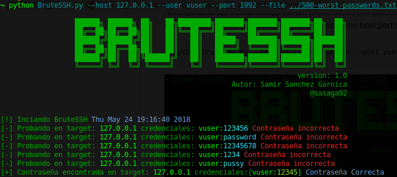

# bruteSSH

bruteSSH es un script escrito totalmente en python para versiones 2.7 el cual permite realizar ataques de fuerza bruta sobre servicios SSH en cualquier puerto en donde se encuentre habilitado el servicio.

Normalmente las herramientas vienen predefinidas por defecto puerto 22 y no permite pasar como parametro el puerto destino.
Ejemplo de uso con rango de puertos
```
python bruteSSH.py --host ip --user usuario --port puerto --file password.txt 
```



Puedes colaborar a que siga creando nuevas herramientas con una donación en [Paypal](https://www.paypal.com) al correo ssanchezga@ufpso.edu.co
by [@sasaga92](https://twitter.com/sasaga92)


:heart_eyes: happy hacking!!!